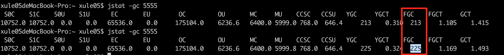
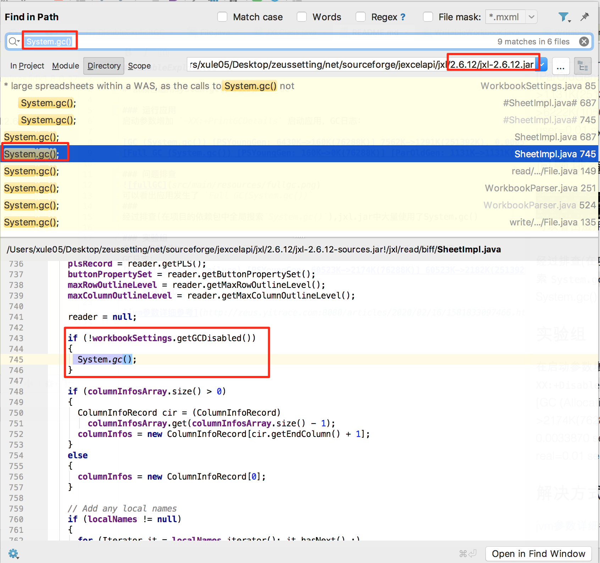

# DisableExplicitGC

# 通用的依赖jar包滥用System.gc()导致的Full GC

### 运行应用
启动参数增加 `-XX:+PrintGCDetails` 启动应用，GC日志：

[GC (System.gc()) [PSYoungGen: 6430K->160K(76288K)] 7562K->1291K(251392K), 0.0005139 secs] [Times: user=0.00 sys=0.00, real=0.00 secs] 
[Full GC (System.gc()) [PSYoungGen: 160K->0K(76288K)] [ParOldGen: 1131K->1131K(175104K)] 1291K->1131K(251392K), [Metaspace: 6222K->6222K(1056768K)], 0.0056141 secs] [Times: user=0.01 sys=0.00, real=0.00 secs]

### 问题排查

可以看出应用发生了 `Full GC(System.gc())`
### 
经过排查(在项目的依赖包中全局搜索`System.gc()`),jxl.jar(导出excel表格的通用jar包)中大量使用了System.gc()

### 解决方式
在启动参数增加 `-XX:+PrintGCDetails` `-XX:+DisableExplicitGC` 启动应用，
GC日志：
[GC (Allocation Failure) [PSYoungGen: 60523K->2174K(76288K)] 60523K->2182K(251392K), 0.0033870 secs] [Times: user=0.01 sys=0.00, real=0.01 secs] 

### 扩展
[jvm参数详细参考](http://zeus.yitrace.com:8080/articles/2020/02/16/1581833097466.html)

